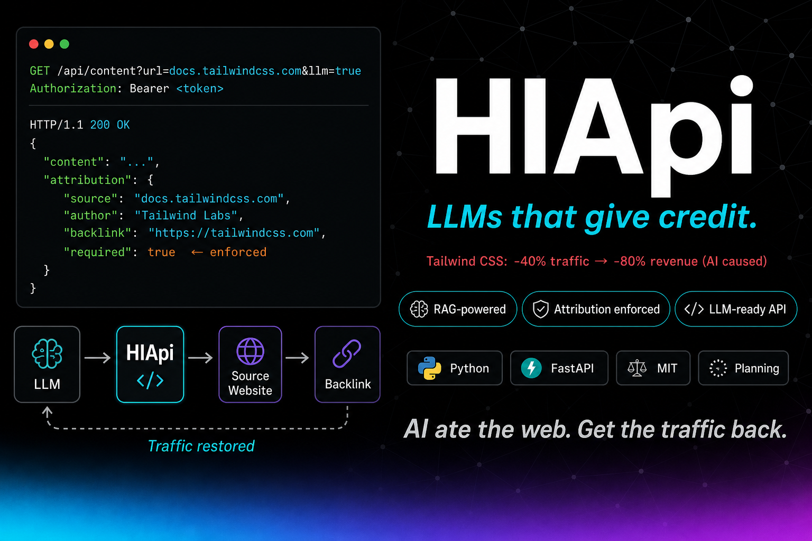

# HIApi — Intelligent API for LLMs with Attribution

[](LICENSE)
[](#roadmap)
[](https://fastapi.tiangolo.com)


**AI ate the web. Get the traffic back.**

> RAG-powered API que expone contenido web a LLMs con attribution obligatoria.  
> Status: Planning Phase

---

## 🎯 What is IApi?

**IApi** (Intelligent API) es una API RAG-powered que expone contenido web a LLMs externos con **attribution obligatoria**, resolviendo el problema de caída de tráfico causado por IA.

### Business Problem

**Caso Tailwind CSS** (2023-2025):
- Tráfico docs: **-40%**
- Revenue: **-80%**
- Layoffs: **75%** equipo (3 de 4 ingenieros)
- **Causa**: LLMs (ChatGPT, Copilot) usan contenido sin generar tráfico de retorno

### IApi Solution

- ✅ API controlada con **attribution obligatoria** (sources + links + firma)
- ✅ **Freemium model** (free 100 q/día, pro 10k q/día, enterprise custom)
- ✅ **RAG pipeline** para datos siempre frescos (<5 min lag)
- ✅ **Spring AI 1.0** + pgvector para embeddings
- ✅ **Astro frontend** (performance óptima + MDX nativo)

---

## 🏗️ Architecture

**Stack**:
- **Backend**: Java 21 + Spring Boot 3.3 + Spring AI 1.0
- **Frontend**: Astro 4.x + TypeScript + Tailwind CSS
- **RAG**: OpenAI Embeddings + pgvector + GPT-4o
- **Billing**: Stripe + tiers enforcement

**See**: [.procontext/knowledge/ARCHITECTURE.md](.procontext/knowledge/ARCHITECTURE.md) for details

---

## ⚖️ System Invariants

5 reglas que **MUST always be true**:

1. **Attribution Obligatoria**: 100% respuestas incluyen sources + links + firma
2. **Datos Siempre Frescos**: Corpus actualizado <5 min desde publicación
3. **Tiers Enforcement**: Rate-limiting estricto (free 100 q/día, pro 10k q/día)
4. **Backward Compatibility**: API v1 changes aditivos o create v2
5. **Security-First**: API Keys nunca en logs, input validation exhaustiva

**See**: [.procontext/context.md](.procontext/context.md) for verification methods

---

## 📚 HCP v1.3.0 Reference Implementation

**IApi es caso de estudio** de HCP v1.3.0 con **estructura mejor que template genérico**.

### Improvements Over Template

| Aspecto | Template | IApi | Mejora |
|---------|----------|------|--------|
| session.md | 243 líneas | 65 líneas | **-73%** |
| decision-log.md | 580 líneas | 180 líneas | **-69%** |
| context.md | 500 líneas | 300 líneas | **-40%** |
| Duplicación | ~20% | 0% | **-100%** |
| Temporal hierarchy | Partial | Complete | ✅ |
| Meta-context | Missing | Explicit | ✅ |

### Innovations

1. **sessions/daily/** - Conversaciones únicas (no en ADRs/Tasks)
2. **planning/adrs/** - ADRs individuales (no inline)
3. **planning/tasks/** - 1 task = 1 file (SRP)
4. **knowledge/history/** - Consolidación semanal → mensual → trimestral
5. **knowledge/milestones/** - Checkpoints por versión
6. **Meta-contexto** - decision-log.md explica relaciones ADRs

**See**: [human-code-ai-protocol/examples/case-studies/iapi-intelligent-api.md](../human-code-ai-protocol/examples/case-studies/iapi-intelligent-api.md)

---

## 🚀 Quick Start (Development)

### Prerequisites
```bash
# Backend
Java 21
PostgreSQL 16 + pgvector
Gradle 8.x

# Frontend
Node.js 20+
npm 10+
```

### Setup
```bash
# Clone
git clone <repo>
cd IApi

# Backend
cd backend
./gradlew bootRun

# Frontend
cd frontend
npm install
npm run dev
```

### Environment
```bash
# Backend
OPENAI_API_KEY=sk-...
DATABASE_URL=postgresql://localhost:5432/iapi
STRIPE_SECRET_KEY=sk_test_...

# Frontend
VITE_API_URL=http://localhost:8080
```

---

## 📂 Project Structure

```
IApi/
├── .procontext/           # HCP v1.3.0 context (reference implementation)
│   ├── context.md         # Overview (300 líneas)
│   ├── session.md         # Estado actual (65 líneas)
│   ├── decision-log.md    # Índice + meta-contexto (180 líneas)
│   ├── spec.yml           # Config HCP
│   ├── README.md          # Onboarding
│   │
│   ├── sessions/daily/    # ⭐ Conversaciones únicas
│   ├── planning/          # ⭐ Tasks + ADRs separados
│   │   ├── tasks/         # 1 task = 1 file
│   │   └── adrs/          # 1 ADR = 1 file
│   ├── knowledge/         # ⭐ Extraction + consolidation
│   │   ├── ARCHITECTURE.md
│   │   ├── milestones/    # Checkpoints por versión
│   │   └── history/       # Consolidación temporal
│   ├── snapshots/         # RESEARCH outputs
│   ├── plans/             # PLAN outputs (delete after verify)
│   ├── verify/            # VERIFY reports (latest only)
│   ├── prompts/           # HCP templates
│   └── skills/            # Reusable procedures
│
├── backend/               # Spring Boot + Spring AI
├── frontend/              # Astro + TypeScript
└── .cursorrules           # Project-specific rules
```

---

## 📖 Documentation

### Core HCP Files
- [context.md](.procontext/context.md) - Project overview, invariantes, roadmap
- [session.md](.procontext/session.md) - Current focus (lightweight)
- [decision-log.md](.procontext/decision-log.md) - Índice ADRs + meta-contexto
- [ARCHITECTURE.md](.procontext/knowledge/ARCHITECTURE.md) - Tech details

### Key Decisions (ADRs)
- [ADR-001](.procontext/planning/adrs/ADR-001-attribution-obligatoria.md) - Attribution obligatoria
- [ADR-002](.procontext/planning/adrs/ADR-002-rag-sobre-finetuning.md) - RAG sobre fine-tuning

### Tasks
- [IAPI-001](.procontext/planning/tasks/IAPI-001.md) - Configuración HCP (current)
- [IAPI-002](.procontext/planning/tasks/IAPI-002.md) - RESEARCH stack técnico (next)

---

## 🎓 Key Learnings

### 1. Caso Tailwind es Anti-Pattern Definitivo
- Revenue -80% cuando LLMs usan contenido sin attribution
- IApi solución: Attribution obligatoria desde MVP (Invariante #1)

### 2. RAG > Fine-tuning para Datos Dinámicos
- Fine-tuning: $500/mes + lag días
- RAG: $20/mes embeddings + <5 min freshness

### 3. Responsabilidad Única Aplica a Documentos
- session.md 243 → 65 líneas (-73%)
- 1 archivo = 1 concern

**See**: [context.md](.procontext/context.md) → Lessons Learned

---

## 📊 Metrics

### Context Management
- **Budget**: 16% (<50% optimal)
- **Onboarding**: -53% time (45 min → 21 min)
- **Duplicación**: 0% (single source of truth)

### HCP Compliance
- ✅ Pattern 5: Temporal Hierarchy (día → trimestre)
- ✅ Pattern 7: Consolidation (weekly protocol)
- ✅ Pattern 8: Multi-Role (Carmack + Liskov)
- ✅ Pattern 9: CFCS (templates ready)

---

## 🛠️ Development

### Workflow (RPI+)
```
RESEARCH  → Read-only, create snapshot
PLAN      → Executable spec, needs approval
IMPLEMENT → Execute plan strictly
VERIFY    → Quality gates, create report
COMPACT   → Consolidate every 5-10 sessions
```

**Current State**: RESEARCH (IAPI-001 @ 95%)

### Quality Gates
- [ ] Tests: 100% passing
- [ ] Coverage: >80% backend, >60% frontend
- [ ] Linter: 0 warnings
- [ ] Attribution: 100% compliance

---

## 🤝 Contributing

**This is a case study project** demonstrating HCP v1.3.0 best practices.

**Use IApi as reference** for:
- ✅ Structure improvements over template
- ✅ Responsibility principle applied to docs
- ✅ Temporal hierarchy implementation
- ✅ Meta-context documentation

---

## 📚 Resources

### Internal
- [.procontext/](.procontext/) - Full HCP context
- [.cursorrules](.cursorrules) - Project rules

### External
- [HCP Specification](../human-code-ai-protocol/spec/) - Protocol details
- [Case Studies](../human-code-ai-protocol/examples/case-studies/) - More examples
- [Templates](../human-code-ai-protocol/templates/) - HCP templates

---

## 📄 License

MIT License (for IApi code)  
HCP v1.3.0 structure is open for reference

---

**HCP v1.3.0 - Reference Implementation**  
*Structure better than template - battle-tested*  
*Use IApi as example for your HCP projects*

---

## Metodología

Desarrollado con [HCP (Human-Code-AI Protocol)](https://github.com/haletheia/human-code-ai-protocol) — protocolo git-native para Context Engineering.
